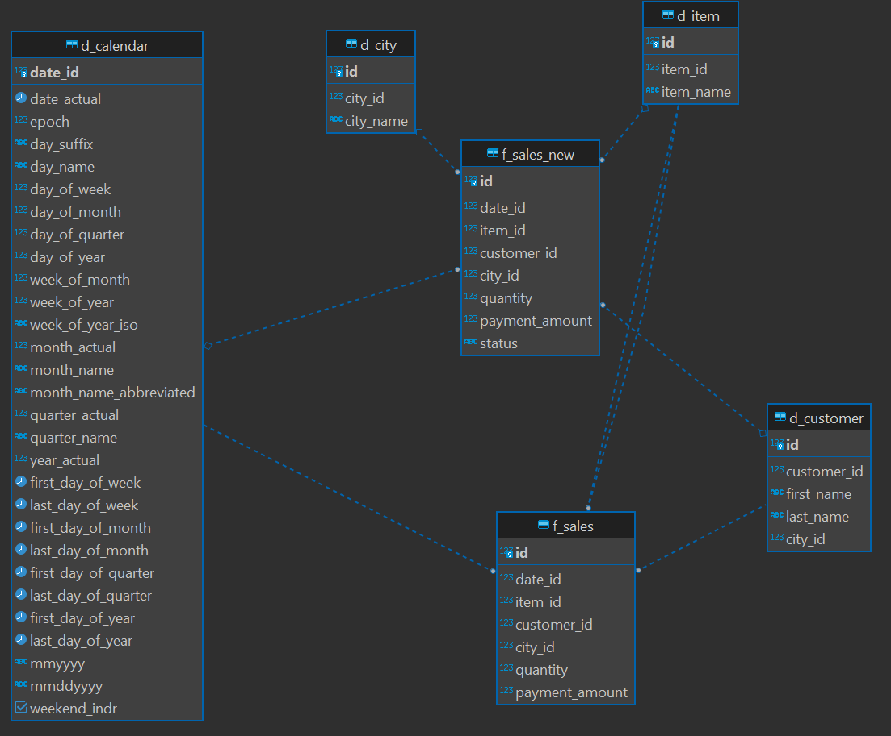

Ваша задача
Адаптируйте ваш пайплайн для текущей задачи:

    1. Учтите в витрине mart.f_sales статусы shipped и refunded. Все данные в витрине следует считать shipped.
    2. Обновите пайплайн с учётом статусов и backward compatibility.

Подсказки:

    1. Необходимо провести миграцию схемы и данных в таблице mart.f_sales.
    2. Таблица фактов mart.f_sales должна приобрести вид транзакционной таблицы фактов. Будьте внимательны со статусом refunded.
    3. Чтобы total revenue правильно рассчитывался, строки с refunded добавляйте со знаком -.
    4. Первый инкремент приходит со старым форматом данных — без статуса заказа. Проверьте, что ваш код правильно проставляет статус в этом случае.

О "backward compatibility".
Чтобы была обратная совместимость, т.е. данные загружались и в текущую таблицу mart.f_sales, и в новую, с учтенными статусами, решено создать таблицу mart.f_sales_new.
Сначала, добудем отрицательные цены для заказов со статусом "refunded" и проверим, что знак "-" проставляется корректно.
```SQL
WITH revenue AS (
	SELECT 
		CASE
			WHEN status = 'shipped' THEN payment_amount
			WHEN status = 'refunded' THEN -payment_amount
		END AS payment_amount, uniq_id
	FROM staging.user_order_log uol		
)
SELECT dc.date_id, uol.item_id, uol.customer_id, city_id, quantity, rev.payment_amount, status 
FROM staging.user_order_log uol 
	INNER JOIN revenue rev ON uol.uniq_id = rev.uniq_id 
	LEFT JOIN mart.d_calendar AS dc ON uol.date_time::Date = dc.date_actual
	WHERE
	(rev.payment_amount > 0
	AND status = 'refunded')
	OR (rev.payment_amount < 0
	AND status = 'shipped');
```
Вернулось 0 строк, count(*) вернул 1258 строк - совпадает с количеством строк в таблице staging.user_order_log и таблице mart.f_sales

Учитывая специфику задачи (доработка, а не разработка), данные в таблицах можно считать корректными.

Выполним миграцию запустив скрипт migrations/f_sales_new_migration.sql:
1. Добавим новую колонку в staging.user_order_log
2. Создадим новую таблицу

Полученная схема с новой таблицей:


Таким образом, нужно в существующий DAG дописать соответствующий таск, пополняющий эту таблицу данными и подложить SQL запрос.

Даг исправлен, запрос приложен. Пункт можно считать выполненным.